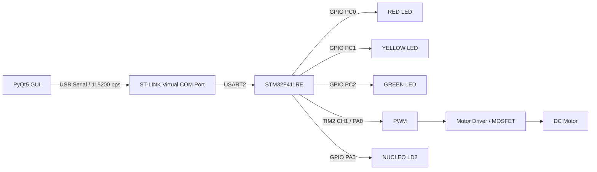
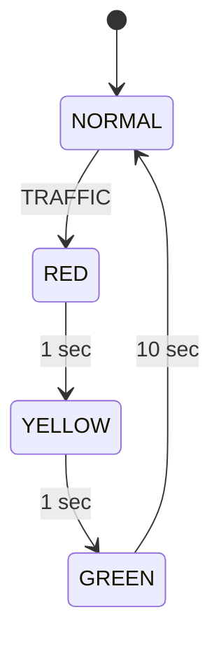

# TrafficMotor FINAL v7 SYSTICK FIX - NUCLEO-F411RE

https://loving-spruce-d3c.notion.site/3bc930b4d58d806a9041daa730388d5a?pvs=73

# STM32F411RE Traffic Signal & Motor Control

**STM32F411RE Cortex-M4 + PyQt5 기반 신호등 및 DC 모터 제어 시스템**

PC의 PyQt5 GUI와 NUCLEO-F411RE 보드를 **UART(USB Virtual COM Port)** 로 연결하여 신호등 상태와 DC 모터를 제어하는 임베디드 프로젝트입니다.

신호등은 **FSM(Finite State Machine)** 으로 동작하며, 모터는 **20 kHz PWM**을 이용해 출력 세기를 조절합니다.

---

## 1. 프로젝트 개요

본 프로젝트는 다음 기능을 구현합니다.

* STM32F411RE 기반 신호등 제어
* RED / YELLOW / GREEN LED 출력
* FSM 기반 신호 상태 전환
* DC 모터 ON / OFF 제어
* PWM Duty 0~100% 속도 제어
* 신호 동작 중 모터 자동 정지
* 신호 종료 후 이전 모터 설정 자동 복원
* PyQt5 기반 PC 제어 GUI
* USART2 기반 PC ↔ MCU 양방향 통신
* 현재 상태 및 PWM 값 실시간 확인
* NUCLEO 내장 LD2를 이용한 펌웨어 생존 상태 확인

---

## 2. 시스템 구성



### 통신 구조

```text
PC
│
│ PyQt5 + pyserial
│
└── USB
     │
     ▼
ST-LINK Virtual COM Port
     │
     │ USART2 / 115200 bps
     ▼
STM32F411RE
     │
     ├── GPIO ── Traffic LEDs
     │
     └── TIM2 PWM ── Motor Driver ── DC Motor
```

---

## 3. 사용 기술

| 구분             | 기술             |
| -------------- | -------------- |
| MCU            | STM32F411RE    |
| CPU Core       | ARM Cortex-M4  |
| Firmware       | C++            |
| Framework      | STM32Cube HAL  |
| Build / Upload | PlatformIO     |
| GUI            | Python / PyQt5 |
| Serial         | pyserial       |
| Communication  | USART2 / UART  |
| Motor Control  | TIM2 PWM       |
| PWM Frequency  | 20 kHz         |
| State Control  | FSM            |
| Debug / Upload | ST-LINK        |

---

## 4. 주요 핀 구성

| 핀   | 기능                 |
| --- | ------------------ |
| PC0 | RED LED            |
| PC1 | YELLOW LED         |
| PC2 | GREEN LED          |
| PA0 | TIM2 CH1 Motor PWM |
| PA2 | USART2 TX          |
| PA3 | USART2 RX          |
| PA5 | NUCLEO LD2 상태 LED  |

---

## 5. 신호등 FSM

GUI에서 **신호 변경 시작** 버튼을 누르면 다음 상태로 동작합니다.



동작 순서:

```text
NORMAL
   │
   │ TRAFFIC
   ▼
 RED
 1초
   │
   ▼
YELLOW
 1초
   │
   ▼
 GREEN
 10초
   │
   ▼
NORMAL
```

GREEN 상태에서는 GUI에 남은 시간이 표시됩니다.

```text
COUNT:10
COUNT:9
COUNT:8
...
COUNT:1
```

---

## 6. 모터 제어 로직

NORMAL 상태에서는 설정된 PWM Duty에 따라 모터가 동작합니다.

```text
PWM 0%   → 정지

PWM 30%  → 30% Duty

PWM 50%  → 50% Duty

PWM 100% → 최대 Duty
```

신호등 FSM이 시작되면 안전한 제어를 위해 실제 PWM 출력이 자동으로 `0%`가 됩니다.

```text
NORMAL
Motor ON
PWM 70%

       ↓ TRAFFIC

RED
Motor OFF

       ↓

YELLOW
Motor OFF

       ↓

GREEN
Motor OFF

       ↓

NORMAL
Motor ON
PWM 70% 복원
```

즉, 신호 동작 중에는 모터가 정지하지만 기존에 설정한 PWM 값은 유지됩니다.

---

## 7. PWM 구현

모터 PWM 출력:

```text
PA0 = TIM2_CH1
PWM Frequency = 20 kHz
Duty = 0 ~ 100 %
```

STM32 시스템 클럭은 HSI 16 MHz를 사용합니다.

TIM2 설정:

```text
Timer Clock = 16 MHz

Prescaler = 15
→ 1 MHz Timer Clock

ARR = 49
→ 1 MHz / 50
→ 20 kHz PWM
```

GUI의 슬라이더 또는 숫자 입력을 이용하여 PWM Duty를 변경할 수 있습니다.

---

## 8. UART 통신

PC와 STM32는 USART2를 통해 통신합니다.

```text
Baud Rate : 115200
Data Bit  : 8
Parity    : None
Stop Bit  : 1
Format    : 8N1
```

NUCLEO-F411RE의 ST-LINK Virtual COM Port를 사용하기 때문에 일반적인 사용 환경에서는 별도의 USB-UART 모듈이 필요하지 않습니다.

### PC → STM32

| 명령                | 기능          |
| ----------------- | ----------- |
| `TRAFFIC`         | 신호등 FSM 시작  |
| `MOTOR_ON`        | 모터 ON       |
| `MOTOR_OFF`       | 모터 OFF      |
| `MOTOR_PWM:50`    | PWM 50% 설정  |
| `MOTOR_PWM:0~100` | PWM Duty 설정 |
| `STATUS?`         | 현재 상태 조회    |

### STM32 → PC

| 응답                 | 의미             |
| ------------------ | -------------- |
| `BOOT:STM32F411RE` | MCU 부팅 완료      |
| `ALIVE`            | 펌웨어 정상 실행 중    |
| `STATE:NORMAL`     | 기본 상태          |
| `STATE:RED`        | RED 상태         |
| `STATE:YELLOW`     | YELLOW 상태      |
| `STATE:GREEN`      | GREEN 상태       |
| `COUNT:n`          | GREEN 남은 시간    |
| `MOTOR:ON`         | 모터 출력 중        |
| `MOTOR:OFF`        | 모터 정지          |
| `PWM:n`            | 설정된 PWM 값      |
| `BUSY:TRAFFIC`     | 이미 신호 FSM 실행 중 |
| `ERR:PWM_RANGE`    | PWM 입력 범위 오류   |
| `ERR:UNKNOWN_CMD`  | 알 수 없는 명령      |

---

## 9. PyQt5 GUI

PC GUI에서 다음 기능을 제어할 수 있습니다.

### Serial

* COM Port 자동 검색
* 포트 새로고침
* STM32 연결 / 연결 해제
* UART TX / RX 로그 확인

### Traffic Signal

* RED / YELLOW / GREEN 상태 표시
* 신호 변경 시작
* GREEN 남은 시간 표시
* 현재 FSM 상태 확인

### Motor

* MOTOR ON
* MOTOR OFF
* PWM 0~100% 설정
* Slider 기반 PWM 조절
* 현재 모터 상태 확인
* 현재 PWM 값 확인

---

## 10. 하드웨어 배선

### Traffic LED

```text
STM32                LED

PC0 ── 330Ω ── RED LED ───── GND

PC1 ── 330Ω ── YELLOW LED ── GND

PC2 ── 330Ω ── GREEN LED ─── GND
```

LED 연결 시:

```text
긴 다리(Anode)   → GPIO / 저항
짧은 다리(Cathode) → GND
```

---

## 11. DC 모터 연결

모터는 STM32 GPIO에 직접 연결하지 않습니다.

권장 구성:

```text
NUCLEO PA0
    │
    │ PWM
    ▼
Motor Driver
또는 MOSFET
    │
    ▼
DC Motor
```

예시:

```text
PA0 ── 1kΩ ── MOSFET Gate

External Power (+)
        │
        ▼
      Motor
        │
        ▼
MOSFET Drain

MOSFET Source ── GND

NUCLEO GND ───── Motor Power GND
```

> **주의**
>
> DC 모터를 PA0과 GND 사이에 직접 연결하면 GPIO 허용 전류 초과 및 모터의 역기전력으로 MCU가 손상될 수 있습니다.
>
> MOSFET 또는 모터 드라이버와 플라이백 다이오드 사용을 권장합니다.

---

## 12. 프로젝트 실행 방법

### 가장 간단한 방법

NUCLEO-F411RE를 PC의 ST-LINK USB에 연결합니다.

프로젝트 최상위 폴더에서 다음 파일을 실행합니다.

### STEP 1. Firmware Build & Upload

```text
1_UPLOAD_FIRMWARE.bat
```

정상적으로 완료되면:

```text
SUCCESS: FIRMWARE UPLOAD COMPLETE
```

가 표시됩니다.

### STEP 2. GUI 실행

```text
2_RUN_GUI.bat
```

GUI 실행 후:

```text
포트 새로고침
      ↓
STLink Virtual COM Port 선택
      ↓
연결
```

순서로 실행합니다.

### 한 번에 실행

Firmware 업로드 후 GUI까지 실행하려면:

```text
RUN_ALL.bat
```

을 실행합니다.

---

## 13. 수동 Firmware Build / Upload

PowerShell:

```powershell
cd .\STM32_Firmware

& "$env:USERPROFILE\.platformio\penv\Scripts\platformio.exe" run
```

업로드:

```powershell
& "$env:USERPROFILE\.platformio\penv\Scripts\platformio.exe" run -t upload
```

정상적으로 완료되면:

```text
[SUCCESS]
```

가 출력됩니다.

---

## 14. GUI 수동 실행

```powershell
cd .\PC_GUI

& "$env:USERPROFILE\.platformio\penv\Scripts\python.exe" -m pip install -r requirements.txt

& "$env:USERPROFILE\.platformio\penv\Scripts\python.exe" .\main.py
```

필요 Python 패키지:

```text
PyQt5 >= 5.15
pyserial >= 3.5
```

---

## 15. UART 단독 테스트

GUI 없이 UART만 확인하려면:

```text
3_TEST_UART.bat
```

을 실행합니다.

정상 동작 예:

```text
PORT: COM5
OPEN: 115200 8N1

TX: STATUS?

RX: b'STATE:NORMAL\r\nMOTOR:ON\r\nPWM:100\r\n'

RESULT: UART OK
```

COM 포트가 COM5가 아닌 경우 `PC_GUI/serial_test.py`에서 실제 포트를 사용하거나 직접 실행할 수 있습니다.

---

## 16. 펌웨어 상태 확인

NUCLEO 보드의 **PA5 / LD2**는 펌웨어 상태 확인용 LED입니다.

정상적으로 메인 루프가 실행 중이면:

```text
LD2
ON
 ↓
OFF
 ↓
ON
 ↓
OFF
```

약 **0.5초 간격으로 점멸**합니다.

또한 UART를 통해 약 5초마다:

```text
ALIVE
```

메시지를 전송합니다.

이를 통해 다음 두 부분을 각각 확인할 수 있습니다.

```text
LD2 점멸 → MCU Main Loop 정상

ALIVE 수신 → UART TX 정상
```

---

## 17. SysTick 문제 해결

PlatformIO + STM32Cube 환경에서 `stm32f4xx_it.c`가 자동 생성되지 않는 경우 SysTick 인터럽트가 기본 `Default_Handler`로 진입하면서 MCU 실행이 멈출 수 있습니다.

본 프로젝트에서는 다음 SysTick Handler를 직접 구현했습니다.

```cpp
extern "C" void SysTick_Handler(void)
{
    HAL_IncTick();
}
```

이를 통해 다음 HAL Tick 기반 기능이 정상적으로 동작합니다.

* `HAL_GetTick()`
* 신호등 FSM 시간 측정
* GREEN 10초 카운트다운
* LD2 Heartbeat
* UART ALIVE 주기 전송

---

## 18. 프로젝트 디렉터리 구조

```text
TrafficMotor_FINAL_v7_SYSTICK_FIXED_NUCLEO_F411RE
│
├── 1_UPLOAD_FIRMWARE.bat
├── 2_RUN_GUI.bat
├── 3_TEST_UART.bat
├── RUN_ALL.bat
│
├── STM32_Firmware
│   ├── platformio.ini
│   │
│   └── src
│       └── main.cpp
│
├── PC_GUI
│   ├── main.py
│   ├── serial_test.py
│   ├── check_env.py
│   ├── requirements.txt
│   └── run_gui.bat
│
└── docs
    ├── PROTOCOL.md
    └── WIRING.md
```

---

## 19. 문제 해결

### `pio` 명령을 찾을 수 없는 경우

```text
pio : 'pio' 용어가 cmdlet...
```

오류가 발생하면 프로젝트의:

```text
1_UPLOAD_FIRMWARE.bat
```

을 사용하는 것이 가장 간단합니다.

또는 PlatformIO 실행 파일을 직접 호출합니다.

```powershell
& "$env:USERPROFILE\.platformio\penv\Scripts\platformio.exe" run
```

---

### COM Port는 연결되지만 응답이 없는 경우

다음 항목을 확인합니다.

1. GUI / Serial Monitor 등 COM Port를 사용하는 프로그램 종료
2. NUCLEO ST-LINK USB 연결 확인
3. Windows 장치 관리자에서 STLink Virtual COM Port 확인
4. Baud Rate `115200` 확인
5. Firmware 재업로드
6. NUCLEO RESET 버튼 실행
7. GUI에서 COM Port 재연결

---

### 외부 RED LED가 켜지지 않는 경우

외부 RED LED는:

```text
PC0
```

에 연결됩니다.

NUCLEO 보드에 기본 장착된 LD2는:

```text
PA5
```

이므로 서로 다른 LED입니다.

LD2는 깜빡이는데 외부 LED가 켜지지 않는 경우에는 PC0 LED의:

* 극성
* 330Ω 저항
* GPIO 연결
* GND 연결

을 확인합니다.

---

## 20. 핵심 구현 내용

이 프로젝트를 통해 다음 임베디드 시스템 요소를 구현했습니다.

* ARM Cortex-M4 기반 MCU 제어
* STM32 GPIO 제어
* Timer 기반 PWM 생성
* DC Motor PWM 제어
* UART Serial Protocol 설계
* PC ↔ MCU 양방향 통신
* FSM 기반 상태 제어
* 비차단 방식 시간 제어
* PyQt5 기반 Embedded GUI
* Hardware / Software 통합 및 디버깅
* SysTick 및 HAL Tick 동작 이해
* ST-LINK 기반 Firmware Build / Upload / Debug

---

## 21. 개발 환경

```text
Board      : NUCLEO-F411RE
MCU        : STM32F411RET6
Core       : ARM Cortex-M4
Firmware   : C++
Framework  : STM32Cube HAL
Build      : PlatformIO
GUI        : Python + PyQt5
Serial     : pyserial
Interface  : USART2 / ST-LINK VCP
PWM        : TIM2 CH1 / PA0
OS         : Windows
```

---

## 22. 향후 개선 방향

* 모터 RPM 피드백 제어
* Encoder 기반 Closed-loop 제어
* PWM 가속 / 감속 제어
* UART 통신 오류 검출
* 통신 Protocol 구조화
* GUI 실시간 그래프 추가
* 센서 입력 기반 FSM 확장
* 비상 정지 기능 추가
* RTOS 기반 Task 구조 확장
* 카메라 / 객체 인식 기반 지능형 신호 제어 확장

---

## Project Summary

> **STM32F411RE Cortex-M4 MCU와 PyQt5 GUI를 UART로 연동하여 신호등 FSM 및 DC 모터 PWM 제어를 구현한 Embedded System Project**
